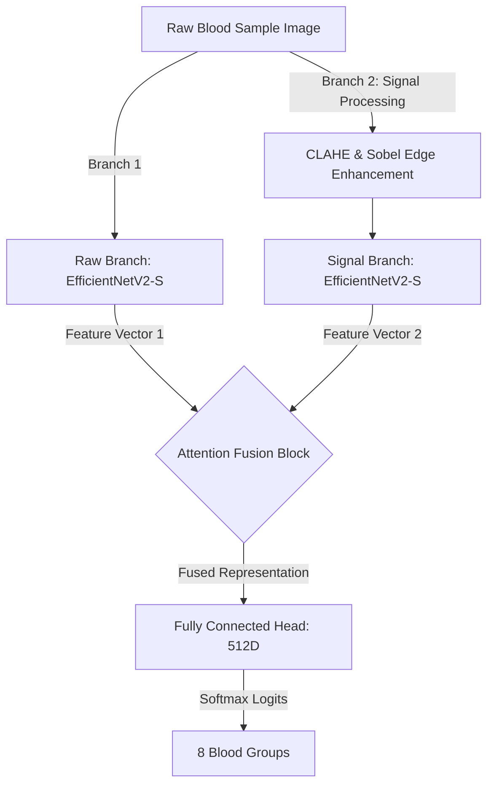

# Blood Group Classification: Dual-Branch Network with Attention Fusion & Signal Processing

[](https://opensource.org/licenses/MIT)
[](https://www.python.org/)
[](https://pytorch.org/)
[](https://expo.dev/)

An end-to-end, state-of-the-art Medical AI system for **blood group classification** from raw images. By fusing raw visual information with enhanced edge signal processed inputs using an **Attention Fusion module**, this system classifies blood into the 8 primary groups (**A+, A-, AB+, AB-, B+, B-, O+, O-**) with extreme precision and explainability.

This repository bundles:
1. **Core Deep Learning & PyTorch Training Code** (Dual-branch architecture using double EfficientNetV2-S backbones).
2. **Explainable AI (XAI)** featuring dynamic **Grad-CAM** activation maps to locate exactly what the AI focuses on.
3. **High-Performance Web Client** (Vite + React frontend with a gorgeous particle glassmorphism interface).
4. **Online REST API Backend** (Flask server serving real-time inference and Grad-CAM overlays).
5. **Fully Offline Mobile Application** (React Native Expo App running local ONNX inference on the mobile CPU, with fully replicated JS-based signal processing).
6. **Native Android APK Reference Setup** (React Native bare workflow utilizing Chaquopy for embedded PyTorch inference).

---

## 🔬 Core System Architecture

Traditional convolutional neural networks (CNNs) often struggle to recognize fine structural patterns in biological images under varying lighting conditions. To solve this, we implement a **Dual-Branch Architecture**:



### 1. Signal Processing Pipeline
To amplify fingerprint ridges or micro-agglutination patterns, Branch 2 applies an active signal processing pipeline:
1. **Grayscale Conversion**: Eliminates color variations, focusing solely on texture and density.
2. **CLAHE (Contrast Limited Adaptive Histogram Equalization)**: Amplifies local contrast adaptively, preventing noise over-amplification.
3. **Gaussian Blur**: Eliminates high-frequency sensor noise.
4. **Sobel Filter**: Calculates pixel gradient magnitudes ($G = \sqrt{G_x^2 + G_y^2}$) to highlight fine structural boundaries.
5. **ImageNet Normalization**: Prepares the stacked 3-channel edge map for the backbone.

### 2. Attention Fusion Module
Instead of a simple concatenation or averaging, a feedforward neural network computes dynamic attention weights ($w_1, w_2$) to blend the features based on their contextual significance:
$$\text{Attention Weights } [w_1, w_2] = \text{Softmax}(\text{Linear}(\text{ReLU}(\text{Linear}([f_{raw}, f_{signal}]))))$$
$$\text{Fused Features } = w_1 \cdot f_{raw} + w_2 \cdot f_{signal}$$

---

## 📁 Repository Layout

```
├── assets/                          # Model training metrics & signal processing visualizations
├── models/                          # Serialized AI model checkpoints (PyTorch & ONNX formats)
│   ├── best_dual_model.pth          # PyTorch weights (179 MB - Tracked via Git LFS)
│   └── model.onnx                   # Exported ONNX model (177 MB - Tracked via Git LFS)
├── flask_app/                       # REST API Backend
│   ├── app.py                       # Flask application with PyTorch & Grad-CAM pipeline
│   ├── templates/                   # HTML web client template
│   └── static/                      # Styling, layout, and frontend JS scripts
├── react_app/                       # Vite + React Modern Web Dashboard
│   ├── src/                         # React UI source files (App, CSS, Main)
│   ├── package.json                 # Web app package configurations
│   └── vite.config.js               # Vite configurations
├── BloodGroupAppExpo/               # Fully Offline React Native Mobile App (Expo SDK 50)
│   ├── App.js                       # On-device CPU inference running local ONNX Runtime
│   ├── assets/                      # Bundled ONNX model & UI assets
│   └── package.json                 # Expo configurations
├── android_native_reference/        # Offline Native Android reference setup
│   ├── App.js                       # Bare workflow React Native App
│   ├── android/                     # Chaquopy bridge code (PythonBridgeModule.java)
│   └── python/                      # CHAQUOPY embedded python script (predict.py)
├── convert_to_onnx.py               # Utility to export PyTorch weights (.pth) to ONNX format
├── build_react.bat                  # Automated batch script to install & build the React Web App
├── run_app.bat                      # Automated script to spin up the Flask + Web Server
└── run_final_build.bat              # Script to build native release APKs
```

---

## 🚀 Setting Up & Running the Projects

### 1. Flask Backend & Web Application
To run the premium web application powered by the Flask server:

#### Prerequisites
Make sure you have Python 3.10+ and the required packages installed:
```bash
pip install torch torchvision timm opencv-python albumentations pytorch-grad-cam flask flask-cors matplotlib pillow numpy
```

#### Running the App
Double-click `run_app.bat` or run:
```bash
python flask_app/app.py
```
Open **[http://127.0.0.1:5000](http://127.0.0.1:5000)** in your browser. You will be greeted by a state-of-the-art glassmorphic dashboard with live particle effects where you can upload, process, and analyze your blood samples.

---

### 2. Vite + React Frontend Dashboard
If you want to build or run the standalone Vite + React dashboard:
1. Double-click `build_react.bat` to install dependencies and run the production build.
2. The compiled assets will be outputted to `react_app/dist/`.
3. To run locally in development mode:
   ```bash
   cd react_app
   npm install
   npm run dev
   ```

---

### 3. Fully Offline Expo Mobile Application (`BloodGroupAppExpo`)
This mobile application is built using Expo and operates **100% offline**. It runs the `model.onnx` locally on the phone's CPU using `onnxruntime-react-native`.

#### How local inference works:
1. **Local Image Selection**: Select an image locally using `expo-image-picker`.
2. **JS-based Signal Processing**: Replicates the Python/OpenCV CLAHE and Sobel edge detection directly in JavaScript via raw typed arrays.
3. **ONNX Runtime Execution**: Creates an on-device `InferenceSession` and feeds the raw and signal processed tensors to the local ONNX model.
4. **No Cloud Dependencies**: Data remains locally secure on the device. Perfect for remote clinics without internet.

#### Setup & Compilation
1. Navigate to the Expo folder:
   ```bash
   cd BloodGroupAppExpo
   ```
2. Install npm dependencies:
   ```bash
   npm install
   ```
3. Run the Expo dev server:
   ```bash
   npx expo start
   ```
4. Build the standalone offline Android APK (via Expo Prebuild & Gradle):
   Double-click `generate_and_build_apk.bat` or run:
   ```bash
   npx expo prebuild --platform android --clean
   # Compile locally to APK
   cd android && gradlew assembleRelease
   ```

---

## 🧪 Experimental Training & Metrics

The training code (detailed in `Dual_Branch_+_Attention_+_Signal_Processing_+_Full_Training_+_Plots.ipynb`) logs impressive results. All metrics are saved inside the `assets/` folder:

* **Training Visualization**: `assets/signal_processing_visualization.png` highlights the raw input side-by-side with the Gaussian-blurred and Sobel-edge-extracted variations.
* **Accuracy and Validation**: `assets/class_accuracy.png` and `assets/class_metrics.png` track performance epochs, showing fast loss convergence and high Precision/Recall.
* **Agglutination Confidence**: `assets/confidence.png` represents prediction certainty scores across cohorts.
* **Confusion Matrix**: `assets/confusion_matrix.png` validates the model's robustness, with very high diagonal values across all 8 classes.

---

## 🛡️ License

This project is licensed under the MIT License - see the [LICENSE](LICENSE) file for details.

## 🤝 Acknowledgments

* **EfficientNetV2** paper by Mingxing Tan and Quoc V. Le.
* **ONNX Runtime** for high-performance cross-platform machine learning inference.
* **Chaquopy** for enabling Python within standard Android environments.
* Dedicated to **Rajendra Sir** for guidance, collaboration, and domain expertise.
